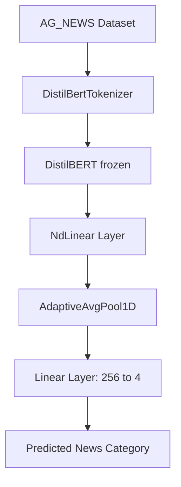

# 📰 News Category Classifier using NdLinear

A lightweight, high-accuracy text classification model that uses HuggingFace Transformers and [NdLinear](https://github.com/ensemble-core/ndlinear) — a next-generation alternative to `nn.Linear`.

This model classifies news headlines into one of four categories: **World, Sports, Business, Sci/Tech**. It achieves **90.35% accuracy** on the AG_NEWS dataset using just 3 epochs and reduced trainable parameters thanks to NdLinear.

---

## Highlights

- ✅ Achieved **90.35% test accuracy** with DistilBERT + NdLinear
- 🔄 Replaces `nn.Linear` with `NdLinear` to preserve token structure
- ⚡ Efficient architecture — can run on CPU or lightweight GPU
---

## Files Included

| File | Description |
|------|-------------|
| `NdLinear.ipynb` | Full training script with NdLinear-based architecture |
| `README.md` | You're reading it :) |

---

## Advantages of using NdLinear?

In this project, I replaced the standard nn.Linear layer with NdLinear to handle the transformation of token embeddings output from DistilBERT. This change provided several key advantages:

- Preserves token structure: Instead of flattening the output from BERT, NdLinear operated directly on the (sequence_length × embedding_dim) format, retaining contextual relationships between tokens before pooling.
- Reduces parameter count: By applying transformations across dimensions individually, NdLinear significantly cut down on the number of parameters compared to a traditional linear layer, making the model more efficient and easier to train. For my project it cut down to 66M from (possibly) 90M
- Improves training stability: The model achieved strong results (90.35% accuracy on the AG_NEWS test set) with fewer parameters and no loss in performance, suggesting better generalization and convergence behavior.

---

## Requirements

Install the required libraries:

```bash
pip install torch transformers datasets ndlinear
```
## Dataset used
- AG_NEWS from Hugging Face Datasets -> https://huggingface.co/datasets/ag_news

Each sample is a short news headline + category label.

## Major Modules and Libraries

- Pytorch:
  - It provides all the low-level tools to define models, losses, and training loops.
  - Offers flexibility to customize architecture (like inserting NdLinear)
  - GPU-accelerated, easy to debug, and widely used in research + industry
 
- HuggingFace Transformers:
  - Gives access to lightweight transformer models like DistilBERT with just a few lines
  - Saves huge time and compute needed to train BERT from scratch
  - Provides tokenizer, pretrained model, and outputs in a consistent interface

- Scikit-learn:
  - Simple utilities for measuring performance: accuracy_score, confusion_matrix
  - Great for reporting results in a standardized way
 
## How Everything Fits Together



## Acknowledgments

- Special thanks to **[Ensemble AI](https://github.com/ensemble-core/ndlinear)** for developing and open-sourcing **NdLinear**, a powerful alternative to traditional linear layers in PyTorch.  
  NdLinear played a key role in this project by preserving the structure of token embeddings and reducing parameter overhead without compromising accuracy.
